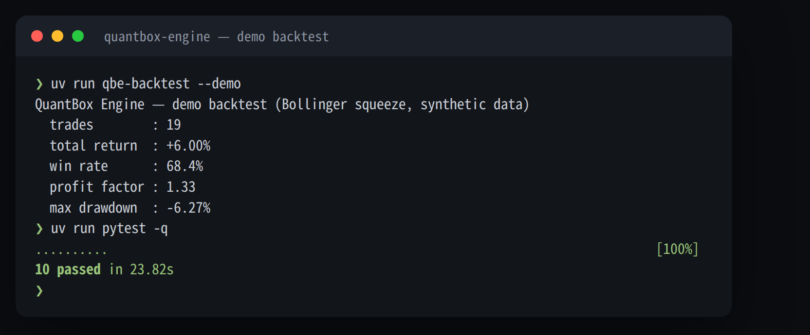

# QuantBox Engine ⚙️

[](https://github.com/younghwan91/quantbox-engine/actions/workflows/ci.yml)
[](https://www.python.org/downloads/)
[](LICENSE)
[](https://www.linkedin.com/in/younghwan-chae/)

**전략에 종속되지 않는 암호화폐 선물 백테스트·실행 엔진.** 백테스트와 실거래가 같은 코드를 타고, 룩어헤드(미래 데이터 참조)가 구조적으로 끼어들 수 없게 짰다.

직접 운용하는 바이낸스 USDT-M 선물 자동매매 시스템에서 전략(알파)만 비공개로 두고 인프라 레이어를 떼어내 공개한 저장소다. 같이 들어 있는 데모 전략은 교과서 로직(볼린저 밴드 스퀴즈)이고, 여기서 보여주려는 것은 "돈 버는 전략"이 아니라 **전략을 제대로 검증하고 실거래까지 안전하게 태우는 엔진**이다.

## 빠른 시작

```bash
uv venv && uv pip install -e ".[dev]"

uv run qbe-backtest --demo      # 합성 데이터로 데모 백테스트
uv run pytest -q                # 테스트 (네트워크·API 키 불필요)
```



> ⚠️ 위 숫자는 **합성 데이터에 데모 전략을 돌린 결과**다. 엔진이 돈다는 것만 보여줄 뿐 수익성과 무관하다.

백테스트는 `numpy` + `pandas` 만으로 돈다. 거래소에 실제 주문을 태울 때만 `python-binance` 가 더 필요하다(`.[live]`).

## 핵심 설계

| 설계 | 어떻게 |
|---|---|
| **룩어헤드 원천 차단** | 백테스터가 매 봉마다 `close[:t+1]`(현재까지 마감된 봉)만 전략에 넘긴다. 전략이 받는 배열에 미래가 없으니 들여다볼 수가 없다. ([테스트로 검증](tests/test_backtest.py)) |
| **백테스트 = 실거래 동일 코드** | 같은 `TradingStrategy` 객체를 백테스터와 라이브 봇이 같은 순서로 호출한다. 재구현 괴리가 생길 자리가 없다. |
| **전략 플러그인 구조** | 엔진은 [`TradingStrategy`](engine/strategy/protocol.py)(PEP 544 프로토콜)로만 전략과 대화한다. 상속 없이 메서드만 맞추면 붙는다. |
| **비용 반영** | 테이커 수수료 + 슬리피지를 진입·청산 양쪽 레그에 매긴다. 나오는 수익률이 gross 가 아니라 net 이다. |
| **서버사이드 청산** | SL/TP·트레일링 스탑을 바이낸스 Algo Order 로 거래소에 걸어둔다. 봇이 죽어도 거래소가 청산한다. ([brackets.py](engine/execution/brackets.py)) |

## 구조

```
engine/
├── strategy/     # 결정 — TradingStrategy 인터페이스 + 데모 전략(볼린저 스퀴즈)
├── backtest/     # 측정 — 봉 단위 백테스터 + 성과 지표 (룩어헤드 차단 지점)
├── data/         # OHLCV CSV 로더 · 합성 데이터 생성기 · 메모리+gzip 캐시
└── execution/    # 실행 — 서버사이드 브래킷, 바이낸스 Algo Order REST 래퍼 (.[live])
```

**결정 / 측정 / 실행** 을 갈라놓고 셋은 `TradingStrategy` 하나로만 맞물린다. 전략은 봉 데이터를 받아 시그널(`-1`/`0`/`+1`)을 내고 자기 포지션의 청산 조건만 관리한다 — 엔진 내부는 모른다.

- 내 전략 붙이는 법·실데이터 백테스트·라이브 실행 → [docs/USAGE.md](docs/USAGE.md)
- 룩어헤드 차단·실거래 일체화·비용 모델의 설계 근거 → [docs/ARCHITECTURE.md](docs/ARCHITECTURE.md)

## 라이선스

MIT


---

## ⭐ 도움이 되셨다면

이 프로젝트가 유용했다면 우측 상단 **[⭐ Star](https://github.com/younghwan91/quantbox-engine)** 를 눌러주세요. 검색·추천 노출이 올라가 더 많은 분들이 찾을 수 있습니다.

- 🐛 버그·질문 → [Issues](https://github.com/younghwan91/quantbox-engine/issues)
- 📈 업데이트 소식 → [팔로우 @younghwan91](https://github.com/younghwan91)

## 관련 프로젝트 — 오픈소스 퀀트 스택

한국·미국 주식과 암호화폐를 아우르는 오픈소스 스택입니다. 각 저장소는 독립적으로 쓸 수 있습니다.

| 축 | 프로젝트 | 설명 |
|---|---|---|
| 🇰🇷 한국 주식 | **[kiwoom-client](https://github.com/younghwan91/kiwoom-client)** | 키움증권 REST API Python 라이브러리 — 국내주식 엔드포인트 전수·실시간 WebSocket, sync + async (`pip install kiwoom-client`) |
| 🇰🇷 한국 주식 | **[krx-fundamentals-api](https://github.com/younghwan91/krx-fundamentals-api)** | 국내 기업 펀더멘탈 REST API — 재무제표·투자지표·배당·종목 스크리닝 (DART + KRX + 네이버) |
| 🇰🇷 한국 주식 | **[krx-news-rest-api](https://github.com/younghwan91/krx-news-rest-api)** | 한국 주식 뉴스·공시 수집 REST API (FastAPI + Redis) |
| 🇰🇷 한국 주식 | **[quant-airflow](https://github.com/younghwan91/quant-airflow)** | 시세·수급·실적을 TimescaleDB 로 수집하는 Airflow 파이프라인 — 상장폐지 종목까지 담아 생존편향을 막는다 |
| 🇰🇷 한국 주식 | **[kr-quant](https://github.com/younghwan91/kr-quant)** | 코스피·코스닥 알파 리서치 — walk-forward·랜덤 음성대조·purged CV·Deflated Sharpe 를 CI 가드레일로 강제 |
| 🇺🇸 미국 주식 | **[portfolio-research](https://github.com/younghwan91/portfolio-research)** | 미국주식 팩터 엔진 — point-in-time·생존편향 보정 데이터 위에서 walk-forward 를 Deflated Sharpe·PBO 로 게이팅 (+ ETF 전술배분 TAA — 9개 사전등록, 채택 0) |
| 🇺🇸 미국 주식 | **[automated-stock-trading-systems](https://github.com/younghwan91/automated-stock-trading-systems)** | Bensdorp 의 7개 비상관 트레이딩 시스템 백테스터 (교육용 재구현) |

## 만든 사람

**채영환 (Younghwan Chae)** · [GitHub @younghwan91](https://github.com/younghwan91) · [LinkedIn](https://www.linkedin.com/in/younghwan-chae/)

전체 오픈소스 퀀트 스택은 [프로필](https://github.com/younghwan91)에서 한눈에 볼 수 있습니다.
